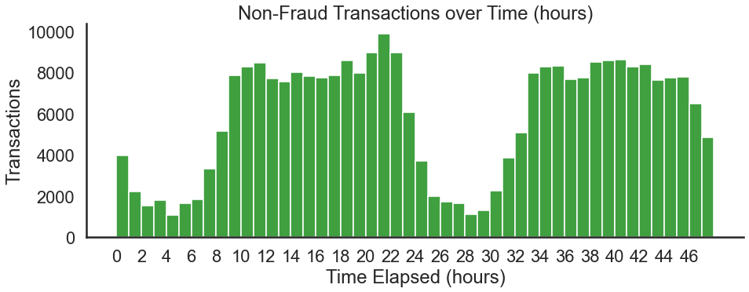
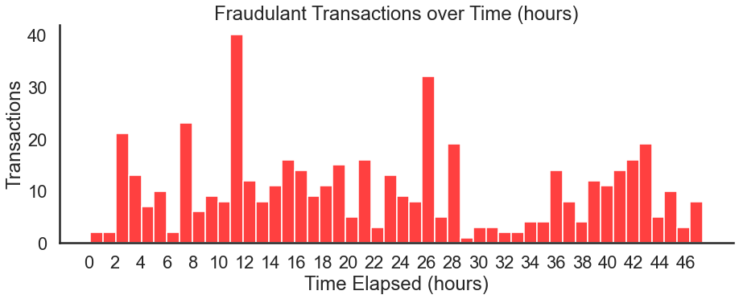
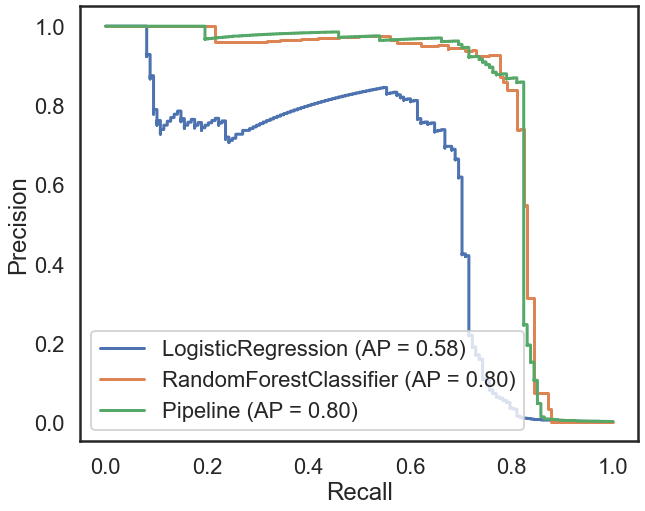
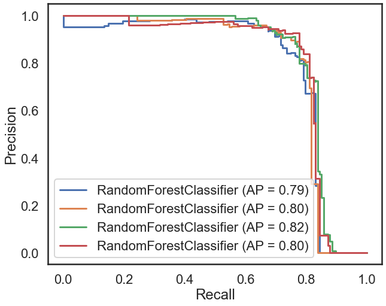
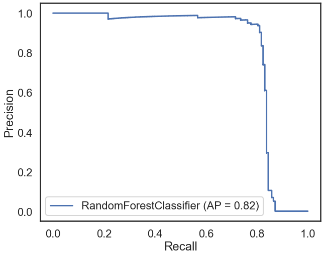
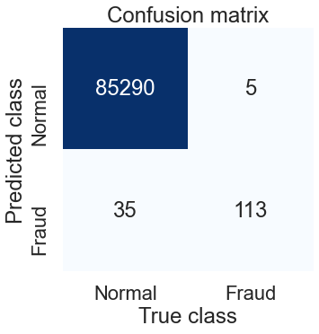

# Credit Card Fraud Analysis and Detection

 
Photo by [Ryan Born](https://unsplash.com/@b0rno?utm_source=unsplash&amp;utm_medium=referral&amp;utm_content=creditCopyText) on [Unsplash](https://unsplash.com/s/photos/credit-card?utm_source=unsplash&amp;utm_medium=referral&amp;utm_content=creditCopyText)

## Problem Statement

Credit card companies receive a significantly smaller percentage of fraudulent charges each hour compared to legitimate transactions. Though a minuscule percentage of overall transactions, fraudulent charges result in many hours of work and lost revenue. How can credit card companies detect up to 90% of fraudulent transactions each month?

After evaluating three different classification models and tuning the best one, precision and recall metric of 0.825 was achieved with the scikit-learn’s Random Forest Classifier model. Though it is not as performant as desired, these experiments’ results pave the path for future model selection, tuning, and evaluation.

## Data Wrangling

The dataset was acquired from Kaggle and contained credit card transactions in September 2013 by European cardholders.

[Kaggle - Credit Card Fraud Detection](https://www.kaggle.com/mlg-ulb/creditcardfraud)

The transactions occurred in two days. Within that time, there were 492 fraudulent transactions out of 284,807 total transactions. Therefore, this data has a highly imbalanced fraud class, making up only 0.173% of all transactions.

The dataset contains only numeric input variables as a result of a PCA transformation due to confidentiality. There are 28 principal components/features labeled V1 through V28. Again due to privacy requirements, the feature labels are not available.

The ‘Time’ feature contains the seconds elapsed between each transaction and the first transaction. The ‘Amount’ feature is the transaction amount in US Dollars. Finally, the ‘Class’ feature contains the binary response variable; 1 for fraud and 0 for non-fraud.

The data did not need any further cleaning due to the PCA transformation and no other missing values. Therefore, the final data shape was 31 features and 284,807 samples.

## Exploratory Data Analysis

As mentioned in “Data Wrangling,” the data went through a Principal Component Analysis (PCA) transformation to anonymize the data. Thus, the visualization of these principal components will not be of much use to understand the data.

We can visualize the number of transactions over time to identify trends and cycles, shown in Figures 1 and 2.

 
_Figure 1 - Number of non-fraud transactions over 48 hours._

 
_Figure 2 - Number of fraud transactions over 48 hours._

Figure 1 indicates a daily cycle showing less activity between hours 1 through 7 and 25 through 31, which might indicate the data starts at midnight. Figure 2 shows that fraudulent are more random, with more spikes in transactions. It is worth reiterating that fraudulent transactions are also much less frequent.

The ‘Amount’ feature has a high variance for both the fraud and non-fraud classes. There is a much higher maximum transaction amount for non-fraud cases, but each is similar in their mean and standard deviation, as shown in Table 1.

| | Mean | Standard Deviation | Max |
|---|---|---|---|
| Non-Fraud | 88.29 | 250.10 | 25691.16 |
| Fraud | 122.21 | 256.68 | 2125.87 |

_Table 1 - ‘Amount’ feature description._

## Model Selection

The following three classification models from scikit-learn were used to evaluate the best classification model: Logistic Regression, Random Forest Classifier, and Support Vector Machines using the RBF kernel.

### Feature Engineering

While neither the Logistic Regression and Random Forest Classifier require scaling, scikit-learn’s StandardScaler was used to scale the feature data before fitting to the SVM model.

The data was split into 70%/30% training/testing sets and stratified on the ‘Class’ feature to ensure an equal percentage of fraud samples in each set, respectively.

| Fraud Class % | Fraud Count | Non-Fraud Count |
|---|---|---|
| Full Dataset | 0.173% | 492 | 284807 |
| Training Set |  0.173% | 344 | 199364 |
| Testing Set | 0.173% | 148 | 85443 |

_Table 2 - Stratified training and testing sets have the same fraud class percentage._

### Evaluation

Since the imbalanced data makes Accuracy a misleading metric, the better metrics to use are Precision and Recall. In this case, the precision/recall area-under-the-curve (PR AUC) is the metric chosen to evaluate the models.

It is worth mentioning that while they exaggerate the performance, the F1 Score and Matthews Correlation Coefficient (MCC) were similar in value, as shown in Table 3.

| Model | P/R AUC | F1 | MCC |
|---|---|---|---|
| Logistic Regression | 0.5803 | 0.6906 | 0.6916 |
| Random Forest Classifier | 0.819 | 0.8365 | 0.8429 |
| SVM w/ RBF Kernel | 0.804 | 0.7469 | 0.7668 |

_Table 3 - Model evaluation with Precision/Recall Area Under the Curve (P/R AUC), F1 Score, and Matthews Correlation Coefficient (MCC)._

 
_Figure 3 - Model evaluation based on Precision/Recall Area Under the Curve. Note that “Pipeline” refers to the SVM scaling and fitting pipeline._

### Upsampling

A typical method for handling imbalanced data is either to upsample the minority class or to downscale the majority class before fitting the model.

Using the best performing “out-of-the-box” model, Random Forest Classifier, I tried three different upsampling techniques and evaluated them. As shown in Table 4, upsampling the minority class did not significantly increase the RFC model performance.

Model | Fraud Count | Non-Fraud Count | P/R AUC |
|---|---|---|---|
| Upsampling Minority Class 1:1 | 199020 | 199020 | 0.8024 |
| Upsampling Minority Class 1:2 | 99510 | 199020 | 0.8221 |
| SMOTE Upsampling 1:1 | 199020 | 199020 | 0.8216 |
| SMOTE Upsampling 1:2 | 99510 | 199020 | 0.8094 |

_Table 4 - RandomForestClassifier with minority class upsampling experiment results._

 
_Figure 4 - RandomForestClassifier with minority class upsampling experiment PR / AUC plots._

## Takeaways

### Final model

A random grid search on the Random Forest Classifier determined a reasonable set of hyperparameters and achieved a final PR-AUC evaluation of 0.8253.

 
_Figure 5 - RandomForestClassifier, the best model PR / AUC plot_

 
_Figure 6 - Confusion matrix for the best model, RandomForestClassifier_

With this model, 113 out of 148 fraud samples were correctly identified (true positives). There were five false negatives (cases when fraudulent transactions were predicted to be non-fraud) and 35 false positives (cases marked as fraud but non-fraud).

### Conclusions

While the Random Forest Classifier did not quite get over 90% prediction rate, it did perform relatively well. It would be interesting to test different models as well as train with more data.

## Future Research

This analysis was a look into a classic imbalanced data problem. It was also an insightful exploration of some popular classification models.

Though 48 hours of transactional data provide a suitable amount of data, it would be more insightful to work with a week or even months’ worth of data.

Additionally, as of this experiment, the data is seven years old. Fraud techniques may change, and therefore this particular model may not generalize to everyday fraud activity.

Though contrived due to the confidentiality issues associated with the date itself, it would be enjoyable to work with real credit card data at some point. In the meantime, there are several research papers listed in the next subsection.

### Relevant further research

* Andrea Dal Pozzolo, Olivier Caelen, Reid A. Johnson and Gianluca Bontempi. Calibrating Probability with Undersampling for Unbalanced Classification. In Symposium on Computational Intelligence and Data Mining (CIDM), IEEE, 2015
* Dal Pozzolo, Andrea; Caelen, Olivier; Le Borgne, Yann-Ael; Waterschoot, Serge; Bontempi, Gianluca. Learned lessons in credit card fraud detection from a practitioner perspective, Expert systems with applications,41,10,4915-4928,2014, Pergamon
* Dal Pozzolo, Andrea; Boracchi, Giacomo; Caelen, Olivier; Alippi, Cesare; Bontempi, Gianluca. Credit card fraud detection: a realistic modeling and a novel learning strategy, IEEE transactions on neural networks and learning systems,29,8,3784-3797,2018,IEEE
* Dal Pozzolo, Andrea Adaptive Machine learning for credit card fraud detection ULB MLG PhD thesis (supervised by G. Bontempi)
* Carcillo, Fabrizio; Dal Pozzolo, Andrea; Le Borgne, Yann-Aël; Caelen, Olivier; Mazzer, Yannis; Bontempi, Gianluca. Scarff: a scalable framework for streaming credit card fraud detection with Spark, Information fusion,41, 182-194,2018,Elsevier
* Carcillo, Fabrizio; Le Borgne, Yann-Aël; Caelen, Olivier; Bontempi, Gianluca. Streaming active learning strategies for real-life credit card fraud detection: assessment and visualization, International Journal of Data Science and Analytics, 5,4,285-300,2018,Springer International Publishing
* Bertrand Lebichot, Yann-Aël Le Borgne, Liyun He, Frederic Oblé, Gianluca Bontempi Deep-Learning Domain Adaptation Techniques for Credit Cards Fraud Detection, INNSBDDL 2019: Recent Advances in Big Data and Deep Learning, pp 78-88, 2019
* Fabrizio Carcillo, Yann-Aël Le Borgne, Olivier Caelen, Frederic Oblé, Gianluca Bontempi Combining Unsupervised and Supervised Learning in Credit Card Fraud Detection Information Sciences, 2019

## Project Organization

------------

    ├── LICENSE
    ├── Makefile           <- Makefile with commands like `make data` or `make train`
    ├── README.md          <- The top-level README for developers using this project.
    ├── data
    │   ├── external       <- Data from third party sources.
    │   ├── interim        <- Intermediate data that has been transformed.
    │   ├── processed      <- The final, canonical data sets for modeling.
    │   └── raw            <- The original, immutable data dump.
    │
    ├── docs               <- A default Sphinx project; see sphinx-doc.org for details
    │
    ├── models             <- Trained and serialized models, model predictions, or model summaries
    │
    ├── notebooks          <- Jupyter notebooks. Naming convention is a number (for ordering),
    │                         the creator's initials, and a short `-` delimited description, e.g.
    │                         `1.0-jqp-initial-data-exploration`.
    │
    ├── references         <- Data dictionaries, manuals, and all other explanatory materials.
    │
    ├── reports            <- Generated analysis as HTML, PDF, LaTeX, etc.
    │   └── figures        <- Generated graphics and figures to be used in reporting
    │
    ├── requirements.txt   <- The requirements file for reproducing the analysis environment, e.g.
    │                         generated with `pip freeze > requirements.txt`
    │
    ├── setup.py           <- makes project pip installable (pip install -e .) so src can be imported
    ├── src                <- Source code for use in this project.
    │   ├── __init__.py    <- Makes src a Python module
    │   │
    │   ├── data           <- Scripts to download or generate data
    │   │   └── make_dataset.py
    │   │
    │   ├── features       <- Scripts to turn raw data into features for modeling
    │   │   └── build_features.py
    │   │
    │   ├── models         <- Scripts to train models and then use trained models to make
    │   │   │                 predictions
    │   │   ├── predict_model.py
    │   │   └── train_model.py
    │   │
    │   └── visualization  <- Scripts to create exploratory and results oriented visualizations
    │       └── visualize.py
    │
    └── tox.ini            <- tox file with settings for running tox; see tox.readthedocs.io

------------

<small>Project based on the <a target="_blank" href="https://drivendata.github.io/cookiecutter-data-science/">cookiecutter data science project template</a>. #cookiecutterdatascience</small>

